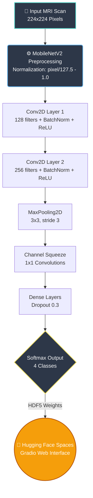

<div align="center">
  <h1>🧠 Axon: Alzheimer's Disease Detection from MRI Scans</h1>
  
  <p>
    <strong>A Deep Learning model for classifying brain MRI scans into 4 stages of Alzheimer's Disease with 93.2% accuracy.</strong>
  </p>

  <p>
    <a href="https://huggingface.co/spaces/BoTahex/axon-alzheimer-detection"></a>
    
    
    
    
  </p>
</div>

---

## 📌 Overview

**Axon** is a Convolutional Neural Network (CNN) designed to assist medical professionals in the **early detection and classification of Alzheimer's Disease** from brain MRI scans. The model classifies each scan into one of four clinical stages:

| Stage | Description |
|-------|-------------|
| 🟢 **Non Demented** | No signs of cognitive impairment |
| 🟡 **Very Mild Demented** | Earliest detectable signs of decline |
| 🟠 **Mild Demented** | Noticeable cognitive impairment |
| 🔴 **Moderate Demented** | Significant cognitive decline |

> 📖 **Research Paper**: For the full methodology, literature review, and detailed results, see our [Research Paper (PDF)](./Axon_Research_Paper.pdf).

---

## 📊 Dataset

We used the **Augmented Alzheimer MRI Dataset** containing **33,984 augmented MRI images** across 4 classes:

| Class | Samples |
|-------|---------|
| Non Demented | 9,600 |
| Mild Demented | 8,960 |
| Very Mild Demented | 8,960 |
| Moderate Demented | 6,464 |

**Data Split:**
- Training: **19,030** images (56%)
- Validation: **10,196** images (30%)
- Testing: **4,758** images (14%)

---

## 🏗️ Model Architecture Pipeline

Our custom **Sequential CNN** was designed for optimal feature extraction from grayscale MRI scans, and deployed directly to Hugging Face for real-time inference:



**Key Design Decisions:**
- **MobileNetV2 Normalisation**: `(pixel / 127.5) - 1.0` for input standardisation
- **Batch Normalisation** after every convolutional layer for stable gradient flow
- **1×1 Convolutions** for efficient channel-wise feature mixing
- **Dropout (30%)** in dense layers to prevent overfitting
- **22 Epochs** of training with early convergence

---

## 📈 Results & Performance

### Training Progress
| Epoch | Train Loss | Train Acc | Val Loss | Val Acc |
|-------|-----------|-----------|----------|---------|
| 1     | 1.367     | 41.1%     | 1.025    | 52.9%   |
| 5     | 0.675     | 69.0%     | 0.602    | 72.8%   |
| 10    | 0.289     | 88.2%     | 0.333    | 86.8%   |
| 14    | 0.105     | 96.2%     | 0.305    | 88.4%   |

### Final Test Evaluation
```
Test Accuracy:  93.2%
Test Loss:      0.2519
```

### Per-Class Classification Report
| Class | Precision | Recall | F1-Score | Support |
|-------|-----------|--------|----------|---------|
| Mild Demented | 0.95 | 0.93 | 0.94 | 2,693 |
| Moderate Demented | 0.99 | 0.99 | 0.99 | 1,977 |
| Non Demented | 0.93 | 0.92 | 0.92 | 2,811 |
| Very Mild Demented | 0.88 | 0.91 | 0.89 | 2,715 |
| **Weighted Avg** | **0.93** | **0.93** | **0.93** | **10,196** |

> **Key Achievement**: The model achieves **99% precision and recall** on Moderate Demented cases, which is critical for identifying severe cases that require urgent medical intervention.

---

## 🚀 Live Demo

Try the model instantly — no setup required:

👉 **[Launch Axon on Hugging Face Spaces](https://huggingface.co/spaces/BoTahex/axon-alzheimer-detection)**

Upload any brain MRI scan and get real-time classification with confidence scores and clinical recommendations.

---

## 💻 Reproduce Locally

### 1. Clone
```bash
git clone https://github.com/ahmedamr022/Graduation_Project.git
cd Graduation_Project
```

### 2. Install Dependencies
```bash
pip install -r requirements.txt
```

### 3. Train the Model
Open and run the Jupyter notebook:
```bash
jupyter notebook Model/alzheimer_cnn_training.ipynb
```

> **Note**: The trained `.h5` weights (~125MB) are hosted on [Hugging Face](https://huggingface.co/spaces/BoTahex/axon-alzheimer-detection) and are not included in this repository to keep it lean.

---

## 📁 Repository Structure

```
Graduation_Project/
├── Model/
│   ├── alzheimer_cnn_training.ipynb   # Full training pipeline
│   └── dataset/                        # Dataset directory
├── assets/
│   └── architecture.png               # Architecture diagram
├── Axon_Research_Paper.pdf            # Published research paper
├── requirements.txt                   # Python dependencies
├── .gitignore
└── README.md
```

---

## 🛠️ Tech Stack

| Category | Technologies |
|----------|-------------|
| **Deep Learning** | TensorFlow, Keras, CNN |
| **Data Science** | NumPy, Pandas, Matplotlib, Seaborn |
| **Image Processing** | OpenCV, PIL, ImageDataGenerator |
| **Evaluation** | Scikit-learn (classification report, confusion matrix) |
| **Deployment** | Gradio, Hugging Face Spaces |

---

## 👨‍💻 Author

**Ahmed Amr** — Machine Learning & Computer Vision Engineer

[](https://ahmedamr022.github.io)
[](https://www.linkedin.com/in/ahmed-amr-13040227b/)
[](https://www.kaggle.com/ahmedamr0222)

---

## 📄 License

This project is open source and available under the [MIT License](LICENSE).
